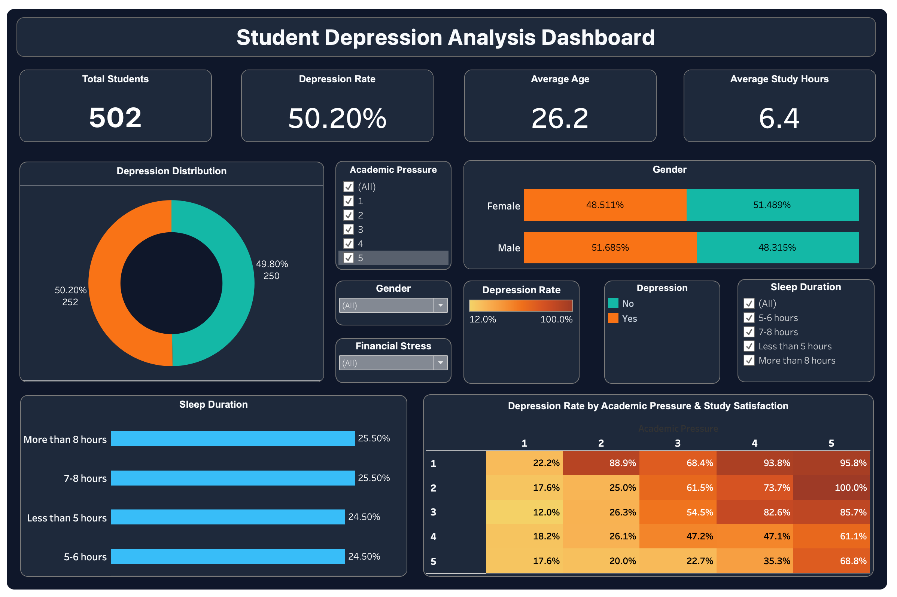
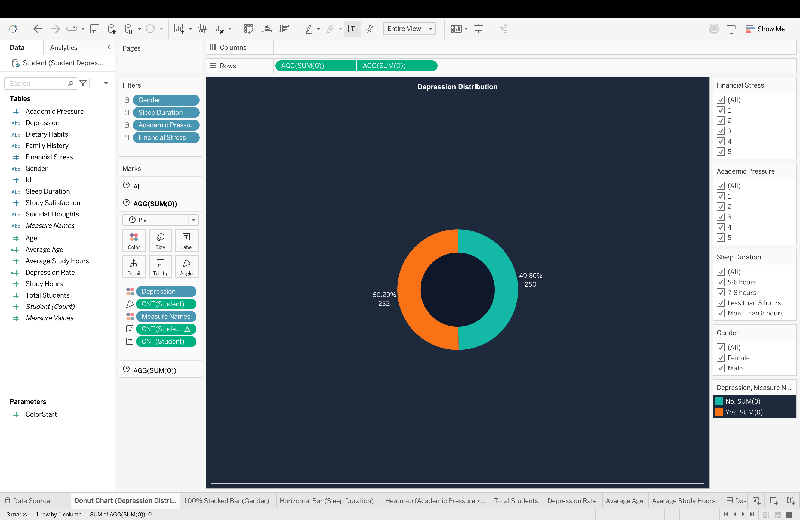
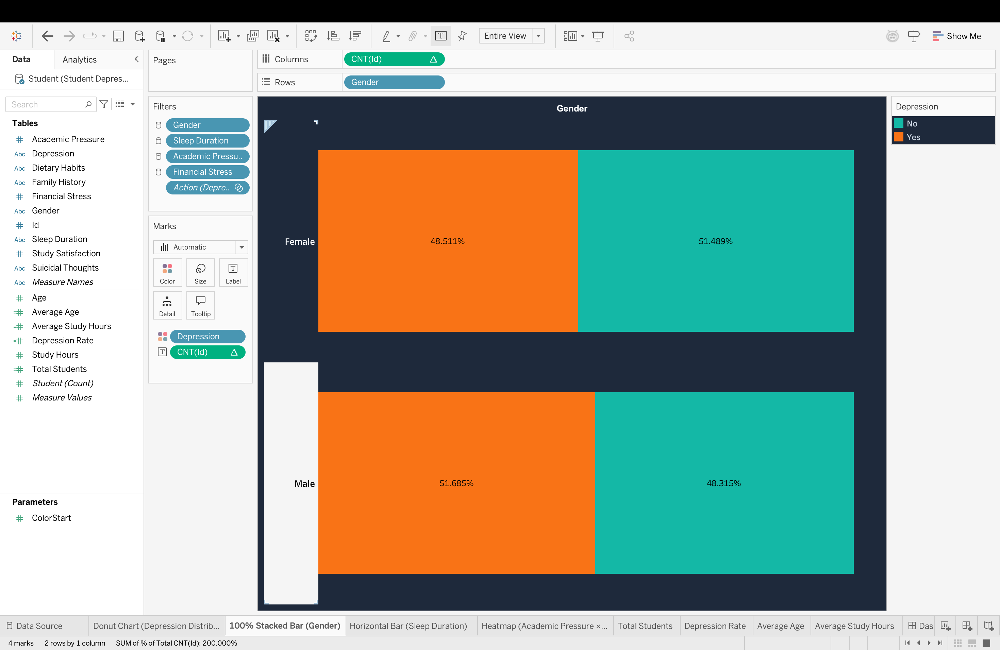
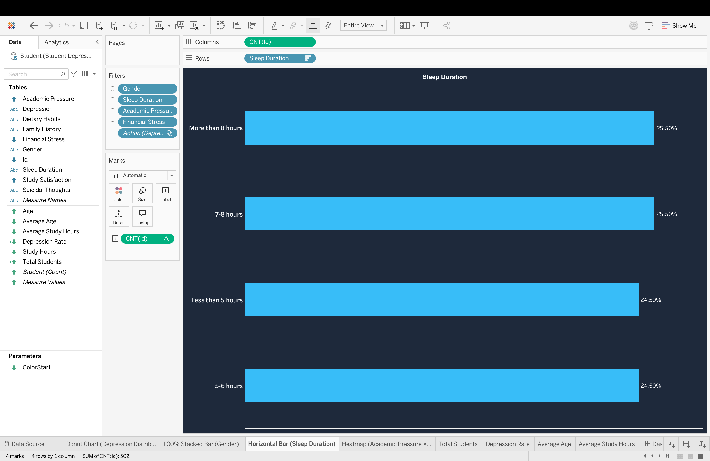
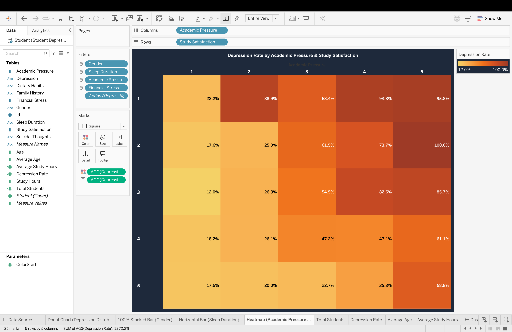

#  Student Depression Analysis Dashboard

> End-to-end **Data Analyst Portfolio Project** using **MySQL, SQL & Tableau** to analyze student mental health and identify depression patterns through data cleaning, exploratory analysis, and interactive visualization.

---

##  Dashboard Preview

> Replace this with your exported dashboard image.



---

##  Project Overview

This project analyzes a real-world **Student Depression Dataset** using SQL and Tableau. The workflow includes data validation, exploratory data analysis (EDA), business insight generation, and an interactive dashboard for decision-making.

###  Objectives

- Clean and validate the dataset using MySQL
- Perform exploratory data analysis with SQL
- Generate business insights using advanced SQL
- Build an interactive Tableau dashboard
- Present findings in a professional portfolio project

---

##  Tech Stack

| Tool | Purpose |
|------|---------|
| **MySQL** | Database & Data Cleaning |
| **SQL** | EDA & Business Insights |
| **Tableau** | Dashboard & Visualization |
| **GitHub** | Version Control & Portfolio |

---

##  Dataset Information

| Attribute | Value |
|-----------|------|
| Dataset | Student Depression Dataset |
| Records | 502 Students |
| Features | 12 Columns |
| Target Variable | Depression (Yes / No) |

### Columns Used

- ID
- Gender
- Age
- Academic Pressure
- Study Satisfaction
- Sleep Duration
- Dietary Habits
- Suicidal Thoughts
- Study Hours
- Financial Stress
- Family History of Mental Illness
- Depression

---

##  Repository Structure

```text
student-depression-analysis-sql-tableau/
│
├── dataset/
│   └── Student_Depression.csv
│
├── sql/
│   ├── 01_database_setup.sql
│   ├── 02_data_cleaning.sql
│   ├── 03_exploratory_analysis.sql
│   └── 04_business_insights.sql
│
├── tableau/
│   └── Student_Depression_Dashboard.twb
│
├── screenshots/
│   ├── dashboard.png
│   ├── donut_chart.png
│   ├── gender_analysis.png
│   ├── sleep_duration.png
│   └── heatmap.png
│
└── README.md
```

---

##  SQL Skills Demonstrated

- Data Validation & Cleaning
- GROUP BY
- ORDER BY
- HAVING
- CASE WHEN
- Aggregate Functions
- Common Table Expressions (CTEs)
- ROW_NUMBER()
- RANK()
- DENSE_RANK()
- Window Functions

---

##  Tableau Dashboard

### KPI Cards

- 👨‍🎓 Total Students
- 📉 Depression Rate
- 🎂 Average Age
- ⏰ Average Study Hours

### Visualizations

| Visualization | Purpose |
|--------------|---------|
| Donut Chart | Depression Distribution |
| 100% Stacked Bar | Gender Analysis |
| Horizontal Bar | Sleep Duration Analysis |
| Heatmap | Academic Pressure × Study Satisfaction |

### Interactive Filters

- Gender
- Academic Pressure
- Financial Stress
- Sleep Duration

---

##  Dashboard Screenshots

### Full Dashboard


### Donut Chart



### Gender Analysis



### Sleep Duration



### Heatmap



---

##  Key Business Insights

- Students with **higher academic pressure** show significantly higher depression rates.
- **Lower study satisfaction** is strongly associated with depression.
- Sleep duration demonstrates a clear relationship with student mental well-being.
- Financial stress contributes to increased depression among students.
- Male and female students show similar overall depression distribution with slight variations.

---

##  SQL Files

| File | Description |
|------|-------------|
| `01_database_setup.sql` | Database creation and table setup |
| `02_data_cleaning.sql` | Data validation & cleaning |
| `03_exploratory_analysis.sql` | 20 SQL EDA queries |
| `04_business_insights.sql` | Advanced SQL, CTEs & Window Functions |

---

##  Learning Outcomes

Through this project I strengthened my skills in:

- SQL Data Analysis
- Data Cleaning
- Exploratory Data Analysis
- Business Problem Solving
- Tableau Dashboard Design
- Data Visualization Best Practices

---

##  Author

**Vedant Patil**

Aspiring Data Analyst

- MySQL
- SQL
- Tableau
- Python
